# IMPRESORA 3D

## Construcción de una impresora 3D de tipo RepRap

### Proceso comentado paso a paso

El paquete presenta el siguiente aspecto:

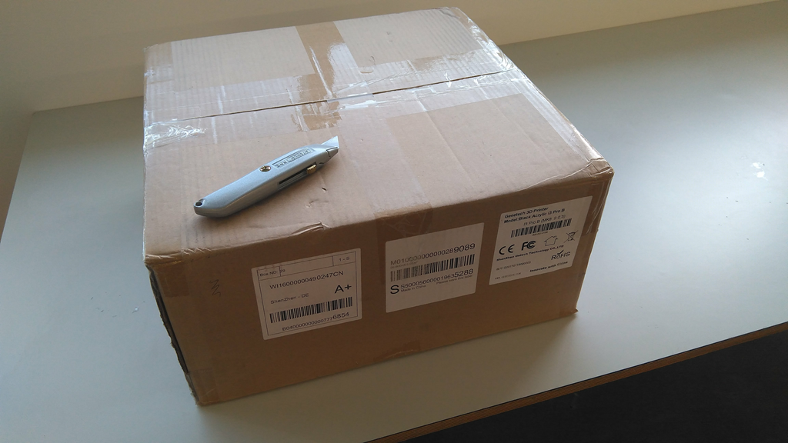

Tras la apertura y unboxing tenemos lo siguiente sobre la mesa:

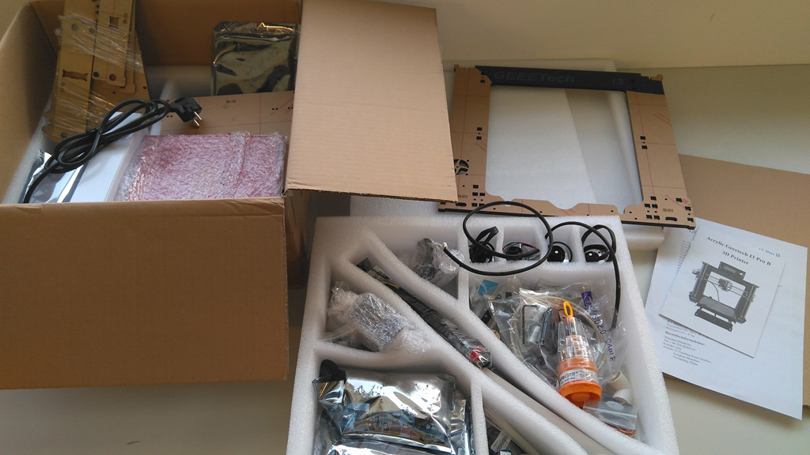

Aquí vemos la tornillería y pequeño material, todo bien colocado en su sbolsa numeradas:

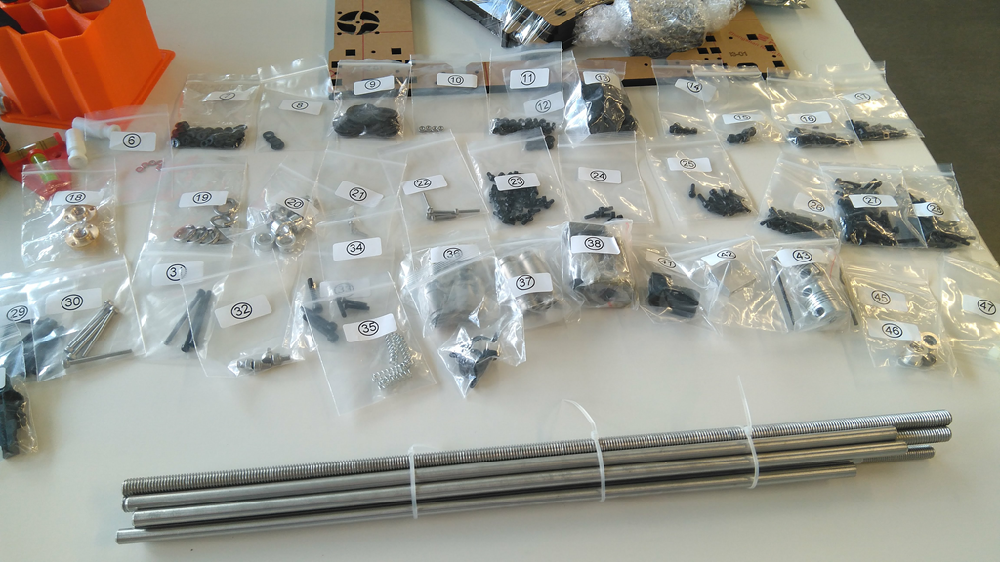

Lo primero es montar la base, que aloja los carriles para el desplazamiento del eje Y:

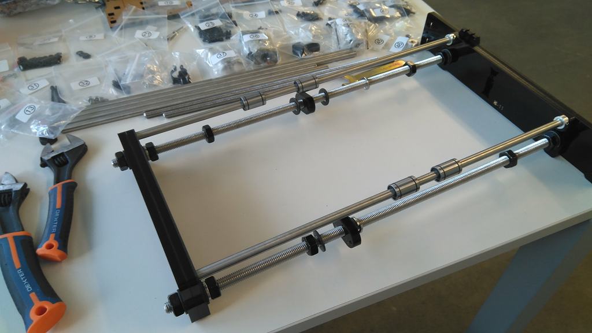

Después se procede a montar la parte vertical, que sostiene el eje Xy Z. Esn este caso y al tratarse de un chasis de plástico acrílico tiene unos refuerzos triangulares, los que vemos aquí:

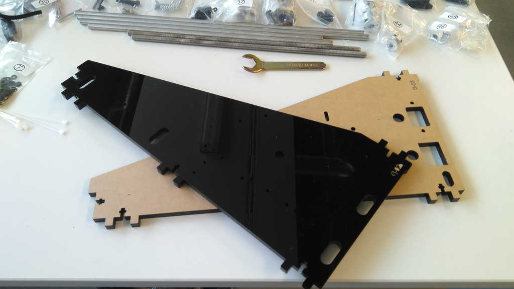

En la foto vemos el chasis ya montado, y a la izquierda gran parte de la electrónica y cableado todavía sin colocar:

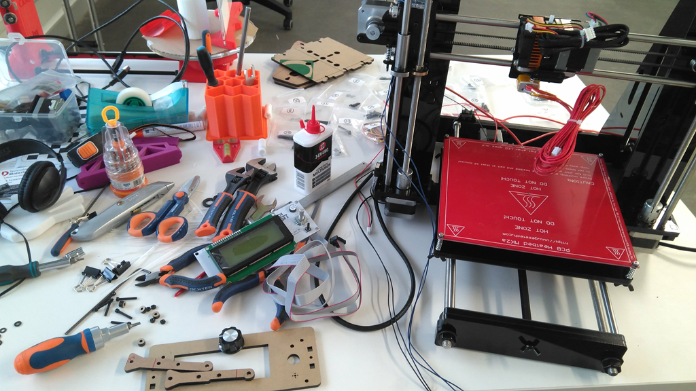

La fuente de alimentación irá adosada al chasis en la parte trasera, aquí vemos sus elementos  antes de instalar.

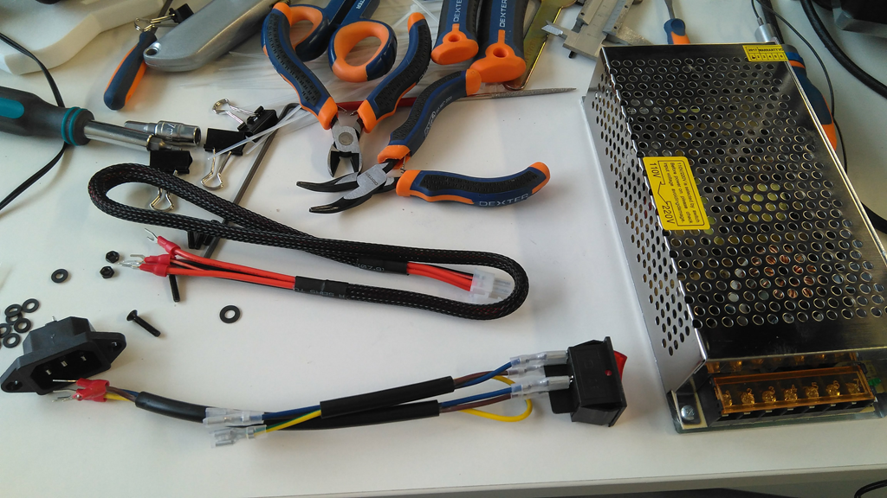

Tras colocarla queda de esta manera. Vemos el conector e interruptor de encendido.

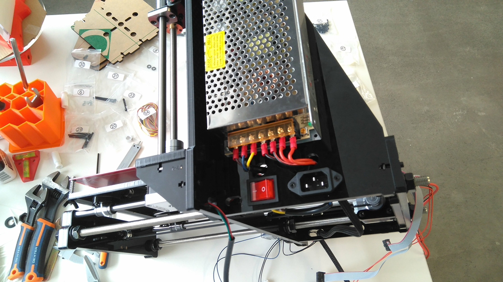

Ahora queda la tarea de cablear todas las conexiones y encintarlo todo:

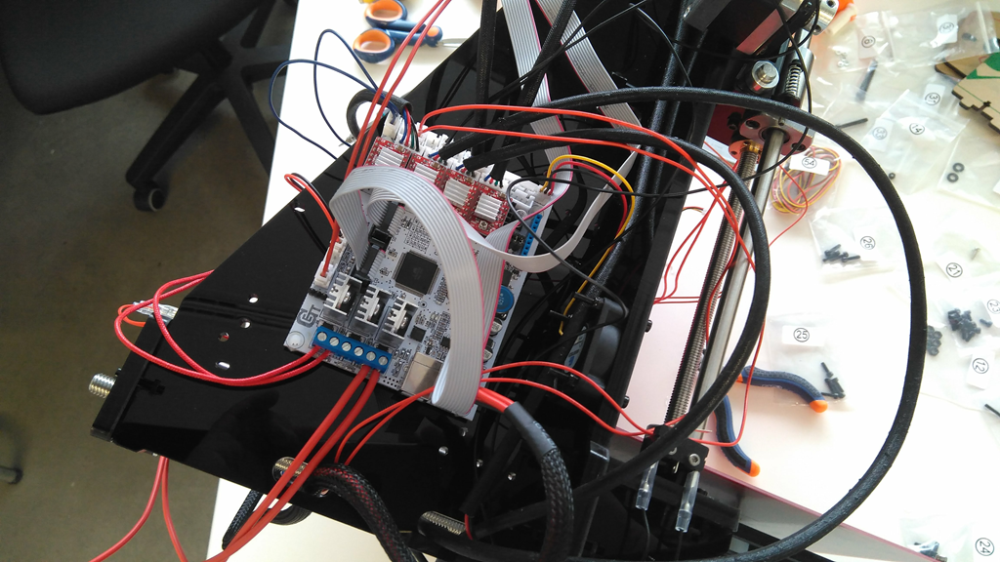

Este es el resultado final:

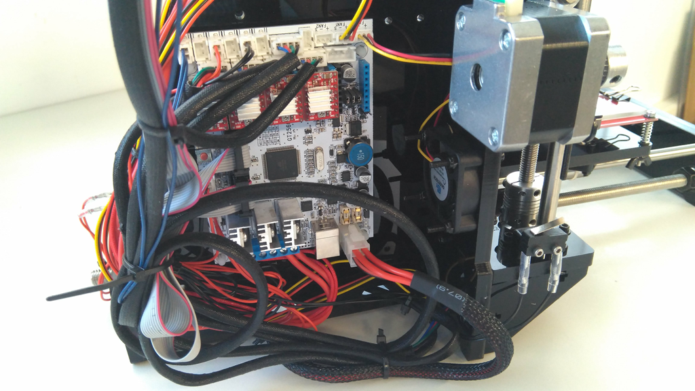

Aquí la impresora totalmente montada:

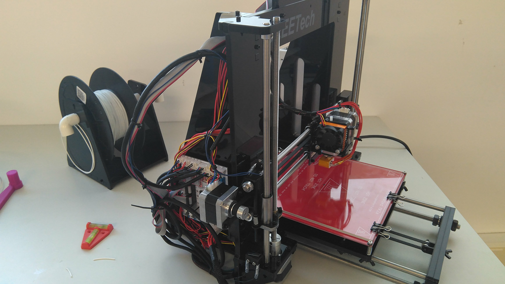

Mas información en [Egokitek.](http://www.egokitek.com)

