# MODULO LASER

## Montaje del módulo láser en la impresora

Es necesario imprimir los siguientes ficheros stl:

[6x soporte imanes](stl/6x-sop-imanes.stl)

[soporte_laser](stl/soporte-laser.stl)

Si los imprimimos juntos tienen el aspecto que se ve en la foto:

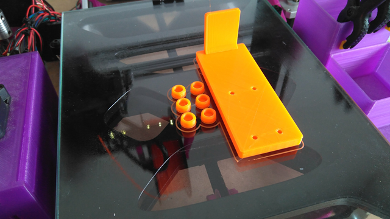

## En construcción

..

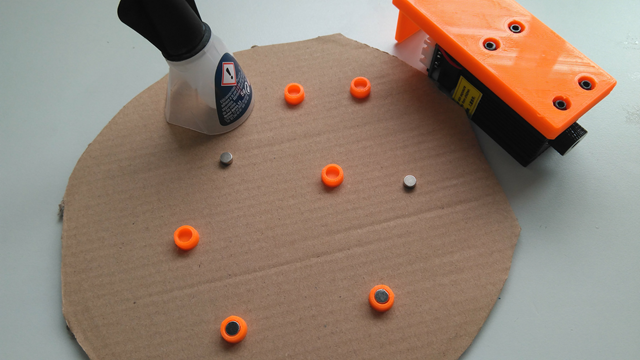

..

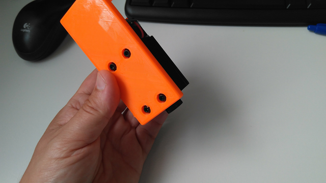

..

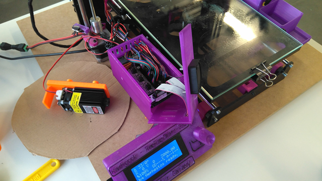

..

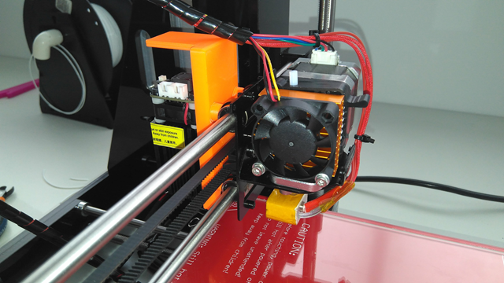

..

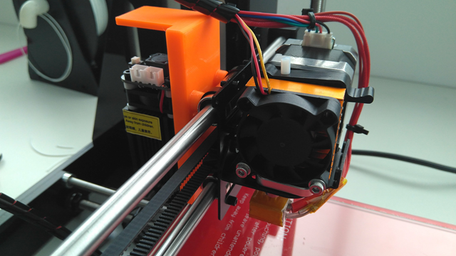

..

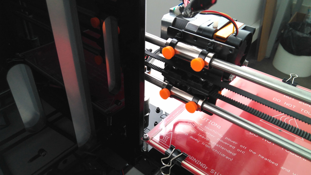

..

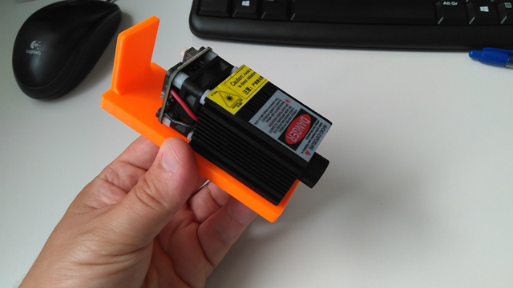

..

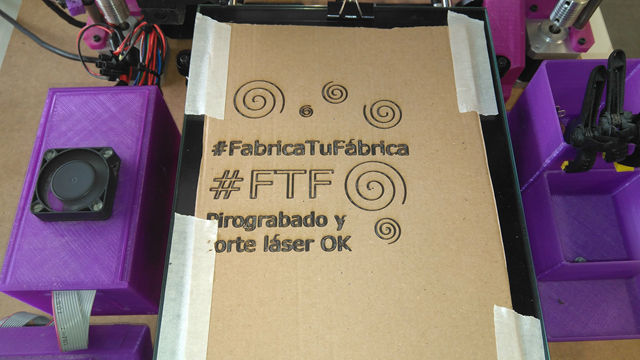

..

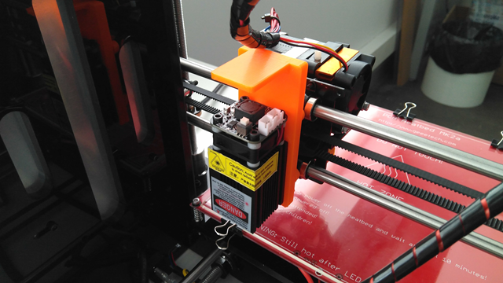

..

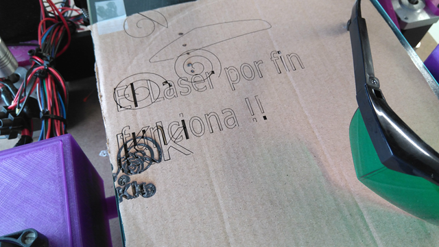

Mas información en [Egokitek.](http://www.egokitek.com)
