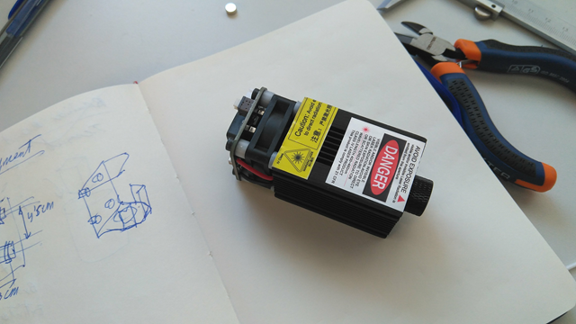
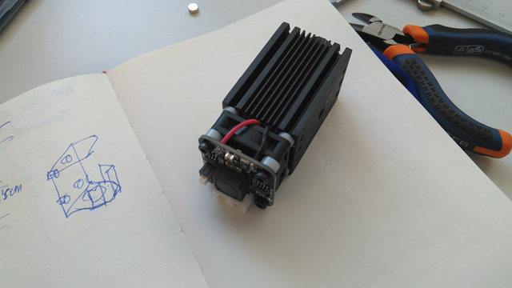

# MODULO LASER

## Añadido de un módulo láser a una impresora 3D Rep-Rap

## Introducción
El laser que empleamos en estos casos es de tipo **LED**, de luz azulada, que trabaja en la banda luminosa de los **450nm**. En este caso el módulo es de **2.5W** aunque se venden ya módulos de 5W. Estas potencias son suficientes para pirograbar y cortar diversos materiales:

**Pirograbado de:**
- Madera
- Cartón, papel etc
- Plásticos
- Cuero
- Alimentos como pan, galletas etc

**Corte de:**
- Madera hasta 3mm
- Plásticos finos, sobre todo goma EVA
- Papel, cartón etc

Es importante en estos casos el color del material. Cuanto mas oscuro mejor. Asimismo y dependiendo de su espesor puede ser necesario hacer varias pasadas del láser para asegurar el corte.

**No podrá trabajar con:**
- Piedra, cristal y minerales
- Metales

El proceso en resumen consiste en colocar un módulo laser pegado a la impresora 3D, de tal forma que está pueda moverlo en el área de trabajo y hacer el pirograbado y/o corte.

**El módulo laser tiene el aspecto de la foto**. Va inserto en un bloque de aluminio negro con aletas, lleva además un pequeño ventilador que facilita la dispación de calor. Y sobre el se encuentra la electrónica que permite pilotar el láser. Necesita 12V de continua con un pulso de tipo PWM. Esto lo  puede suministrar la impresora del modo que explicaré mas adelante.

Por la parte inferior el aspecto es similar. En la parte superior lleva además una pegatina para recordarnos lo peligroso que es y que debe usarse siempre gafas protectoras. En el caso de este tipo de láser las gafas son de color verde.

**Para construir el soporte y fijar el módulo a la impresora:**

[Proceso de montaje comentado paso a paso](Montaje.md)

**Para configurar el software necesario en el ordenador**

[Configuración del software](Configuracion_software)

**Para crear un fichero y utilizarlo con el láser**

[Proceso para crear un fichero GCODE](Creacion_fichero_corte)

Mas información en [Egokitek.](http://www.egokitek.com)
